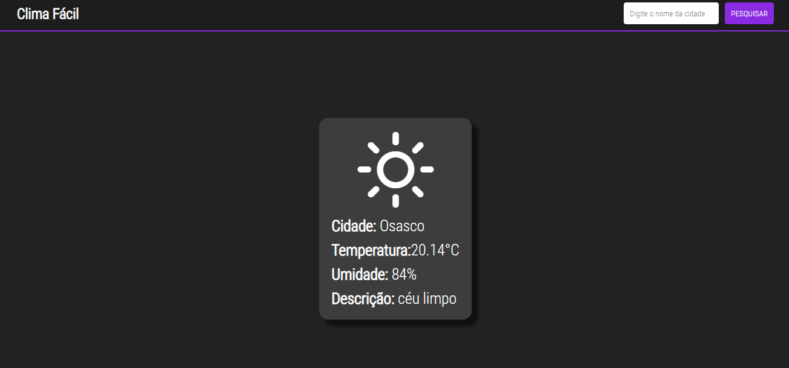

# Clima Fácil

Clima Fácil é um projeto que utiliza a API do OpenWeather para fornecer informações sobre o clima. É possível obter informações sobre a temperatura atual em sua localidade ou pesquisar por uma cidade específica.

## Tecnologias utilizadas
- **JavaScript:** Linguagem de programação utilizada no projeto.
- **HTML:** Linguagem de marcação utilizada na construção do site.
- **CSS:** Linguagem de estilo utilizada na estilização do site.
- **Axios:** Biblioteca JavaScript utilizada para fazer requisições HTTP..
- **Weather-icons**: Biblioteca de ícones utilizada para exibir ícones correspondentes ao clima atual.
- **Bitbucket**: Plataforma utilizada para hospedar o repositório dos arquivos da biblioteca Weather-icons .
- **Githack**: Serviço utilizado para gerar o CDN utilizado no projeto.

## Screenshot

  

        
    

    

        
    

## Como funciona
Ao acessar a página, o sistema irá obter a localização atual do usuário (caso permitido) e exibir as informações sobre a temperatura, umidade e descrição do clima. O sistema utiliza a API do OpenWeather para obter as informações.

Também é possível realizar uma pesquisa por uma cidade específica, inserindo o nome da cidade no campo de busca e clicando em "Buscar".

O projeto utiliza a biblioteca Weather-icons para exibir ícones correspondentes ao clima atual.

Além disso, o sistema detecta a configuração de tema (light ou dark) do navegador do usuário e adapta as cores do site de acordo com a preferência.

## Como usar
Para utilizar o projeto, basta clonar este repositório e abrir o arquivo index.html em um navegador.

## Licença
Este projeto está licenciado sob a licença MIT. Consulte o arquivo LICENSE para mais informações.
